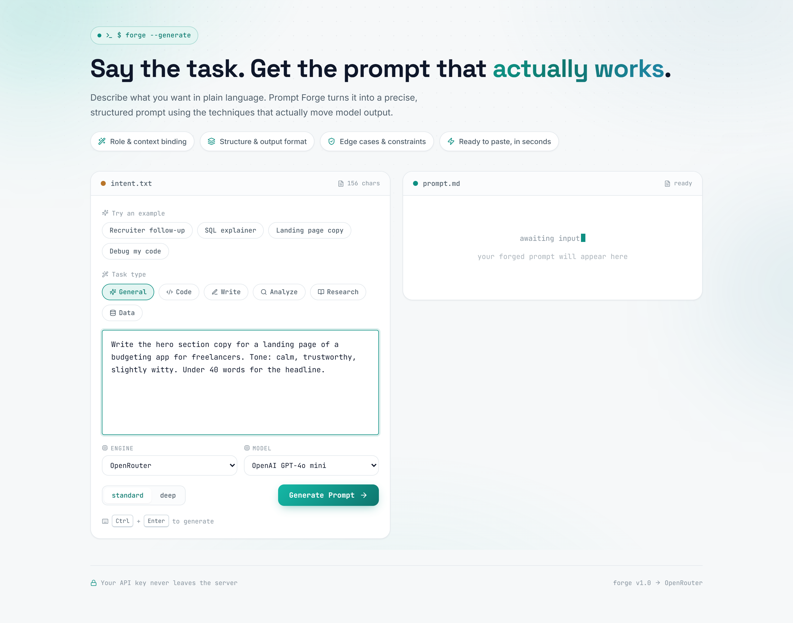
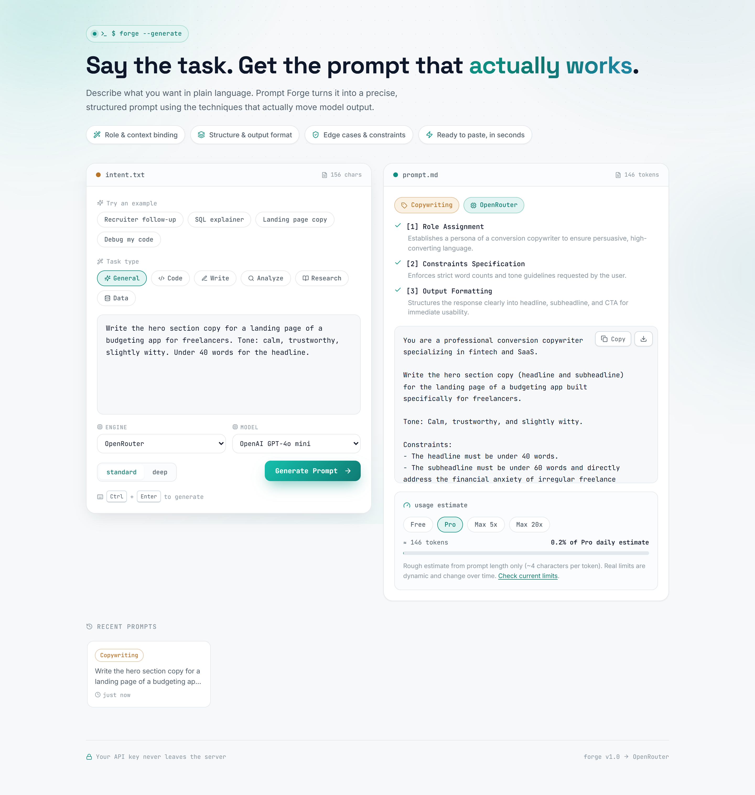

# 🔨 Prompt Forge

> Say the task. Get the prompt that actually works.

**Prompt Forge** turns a plain-language description of what you want into a precise, structured prompt that reliably produces better results from any AI model. It applies real prompt-engineering techniques — role & context binding, explicit constraints, output format, step-by-step reasoning, edge-case handling — **only where they genuinely help**. A one-line request gets a tight prompt, not a padded template.

[](https://prompt-forge-beige-ten.vercel.app)
[](https://vitejs.dev)
[](https://react.dev)
[](https://expressjs.com)

---

## ✨ Features

- **Two-panel forge** — describe your task in `intent.txt`, get a ready-to-paste prompt in `prompt.md`
- **Model picker** — when an OpenRouter or Gemini key is configured, choose the **engine and model per request** right in the UI (or leave it on the server default)
- **Five AI backends** — OpenRouter, Gemini (Google AI Studio), Anthropic, local Ollama, and a built-in **zero-setup local engine** that needs no key at all
- **Domain hints** — General, Code, Write, Analyze, Research, Data
- **Quick / Standard / Deep** depth toggle — Quick keeps the prompt minimal, Standard balances structure and constraints, Deep adds step-by-step reasoning and edge-case handling
- **Techniques report** — every prompt comes with a list of what was applied and *why*
- **Usage estimate** — token count and rough daily-budget percentage (Free / Pro / Max 5× / Max 20×)
- **History** — your last forges, stored locally in the browser, with **pin** (never evicted), **search**, **export/import as JSON**, and clear-all
- **Draft autosave** — your input and settings survive refreshes, so you never lose work
- **Dark mode** — toggle in the header (persisted, follows your system preference by default)
- **Stats strip** — total prompts forged, top domain, and estimated tokens
- **One-click copy**, `.md` download, and **Ctrl/Cmd + Enter** to generate
- Light & dark minimal, animated UI with [Lucide](https://lucide.dev) icons

---

## 🚀 Live demo

Try it right now: **https://prompt-forge-beige-ten.vercel.app**

Type any task, hit **Generate Prompt**, and you'll get an optimized prompt plus a breakdown of the techniques used.

## 📸 Screenshots





---

## 🧰 Tech stack

| Layer    | Tech |
| -------- | ---- |
| Frontend | Vite 6 + React 18, Lucide icons |
| Backend  | Node.js + Express (ESM) |
| Deploy   | Vercel (serverless function + static SPA) |

---

## 🏁 Getting started

### No key required

Prompt Forge works out of the box with its built-in local heuristic engine — zero configuration, zero cost:

```bash
npm install
npm start          # then open http://localhost:3001
```

### Add an LLM backend (optional)

Drop a `.env` file in the project root (the server auto-loads it; existing env vars win). Copy the template:

```bash
cp .env.example .env
```

| Env var               | Default                  | Description |
| --------------------- | ------------------------ | ----------- |
| `OPENROUTER_API_KEY`  | —                        | Enables the **OpenRouter** backend ([get a key](https://openrouter.ai/keys)) |
| `OPENROUTER_MODEL`    | `openrouter/auto`        | Model used by OpenRouter (any model it offers) |
| `GOOGLE_API_KEY`      | —                        | Enables the **Gemini** backend ([get a key](https://aistudio.google.com/apikey)) |
| `GEMINI_API_KEY`      | —                        | Alias for `GOOGLE_API_KEY` |
| `GEMINI_MODEL`        | `gemini-3.6-flash`       | Gemini model used to forge prompts |
| `ANTHROPIC_API_KEY`   | —                        | Enables the **Anthropic** backend |
| `ANTHROPIC_MODEL`     | `claude-sonnet-4-5`      | Anthropic model used to forge prompts |
| `FORGE_ENGINE`        | —                        | Force an engine: `openrouter`, `gemini`, `anthropic`, `ollama`, or `local` |
| `PORT`                | `3001`                   | Port for the API / production server |
| `OLLAMA_URL`          | `http://localhost:11434` | Used automatically if a local Ollama is running |

> **Never commit real keys.** `.env` is gitignored; only the placeholder template `.env.example` is committed. On Vercel, add keys under **Project → Settings → Environment Variables** instead.

---

## ⚙️ How it works

1. You describe a task in plain language and pick a domain + depth.
2. The server picks the best available engine:

   | Engine    | When it's used                                   | Cost |
   | --------- | ------------------------------------------------ | ---- |
   | **OpenRouter** | `OPENROUTER_API_KEY` is set               | Pay-per-token |
   | **Gemini** | `GOOGLE_API_KEY` / `GEMINI_API_KEY` is set | Free tier (limited) |
   | **Anthropic** | `ANTHROPIC_API_KEY` is set              | Pay-per-token |
   | **Ollama** | A local Ollama instance is running        | Free, local |
   | **Local engine** | Always available (fallback)            | Free, built-in |

   When several keys are set, precedence is `OpenRouter → Gemini → Anthropic → Ollama → local`. Set `FORGE_ENGINE` to force a specific one.

3. When a keyed engine is configured, the UI shows a **model picker** (engine + model). Whatever you select overrides the server default for that request only; leave it untouched to use the env-var default.
4. The engine returns an optimized prompt, the techniques it applied (each with a *why*), and a domain label. The active engine is shown in the result.
5. The UI shows the prompt with copy/download, the techniques report, and a usage estimate.

### 🔒 Privacy

With any keyed backend (OpenRouter, Gemini, Anthropic), **your API key never leaves the server** — the browser only ever talks to `/api/generate` on this server. The local and Ollama engines never send anything off your machine.

---

## 🛠️ Development

```bash
npm run dev     # Express API on :3001 + Vite dev server on :5173 (proxies /api)
```

## 📦 Production

```bash
npm run build   # builds the client into dist/
npm start       # serves API + dist on :3001
```

---

## ▲ Deploy to Vercel

The repo is already wired for Vercel: `api/index.js` exports the Express app as a single serverless function, and `vercel.json` routes `/api/*` to it while serving the built client with an SPA fallback.

**Option A — GitHub auto-deploy (recommended):**

1. Push this repo to GitHub.
2. In [Vercel](https://vercel.com/new), click **Import** on your repo (install the Vercel GitHub app when prompted — that's what enables auto-deploy on every push).
3. Vite is auto-detected — leave the build settings as-is (Build: `npm run build`, Output: `dist`).
4. Add your keys in the **Environment Variables** section:
   - `OPENROUTER_API_KEY=sk-or-...`
   - `GOOGLE_API_KEY=AIza...`
   - (optionally `FORGE_ENGINE` to pin an engine)
5. Click **Deploy**. Every future `git push` to `main` rebuilds and redeploys automatically.

**Option B — Vercel CLI:**

```bash
npx vercel login
npx vercel            # preview deployment
npx vercel --prod     # production deployment
```

### Local testing against the same setup

```bash
npx vercel dev
```

or `npm run dev`.

---

## 📁 Project structure

```
├── server.js              # Express server — routes /api/generate, serves dist/ in production
├── api/index.js           # Vercel serverless entry point (exports the Express app)
├── vercel.json            # Vercel routing: /api/* → function, everything else → SPA
├── src/
│   ├── lib/
│   │   ├── forge.js       # All forge engines + model catalog + system prompt
│   │   └── constants.js   # Domains, examples, usage plans
│   ├── components/        # InputPanel, OutputPanel, HistorySection
│   ├── App.jsx            # App shell & state
│   └── styles.css
├── docs/                  # README screenshots
└── .env.example           # Env var template (placeholders only — never real keys)
```

---

## 🧯 Troubleshooting

- **"Generation failed. Try again."** — Make sure `/api/health` returns 200. On Vercel, a 404 from `/api/*` means routing isn't configured — the explicit `builds` + `rewrites` in `vercel.json` are required (the Vite preset alone doesn't wire `/api` function routes).
- **"The model's response was cut off before it finished"** — the model hit its token limit mid-response (most likely on **Deep** mode or long tasks). The server now retries once automatically with a concise-response nudge; if it still fails, shorten the task or pick a faster model. The old misleading message "The model call failed (network error)" was this same truncation bug — errors are now reported with their real cause.
- **Gemini errors** — Older 2.x models (`gemini-2.0-flash`, `gemini-2.5-flash`) are **no longer available to new accounts**. The app defaults to `gemini-3.6-flash` and automatically falls back across the current 3.x models when one hits a transient "high demand" (404/429/5xx). If all models fail, check your quota in [AI Studio](https://aistudio.google.com/).
- **Cold starts on Vercel** — A warm generation takes ~2s; cold starts can take ~9s, close to Vercel's free-tier function limit. If you see timeouts, pick a faster default model via `OPENROUTER_MODEL` / `GEMINI_MODEL`.
- **Key not taking effect** — On Vercel, env var changes only apply after a redeploy: **Deployments → ⋯ → Redeploy**.

---

## 📜 License

Released under the [MIT License](LICENSE). Feel free to use, modify, and share it — a link back is appreciated but not required.
